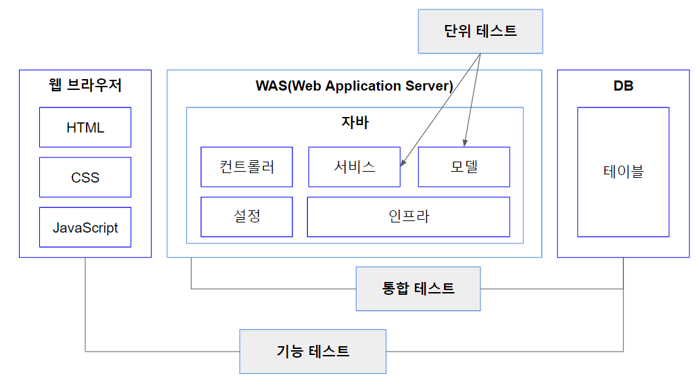
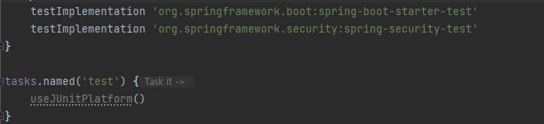
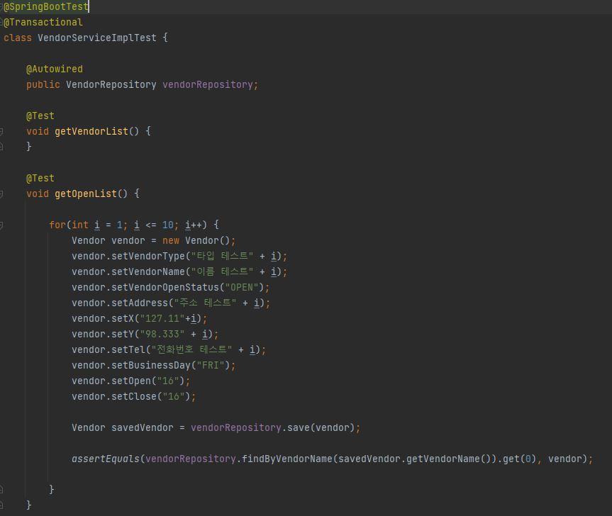
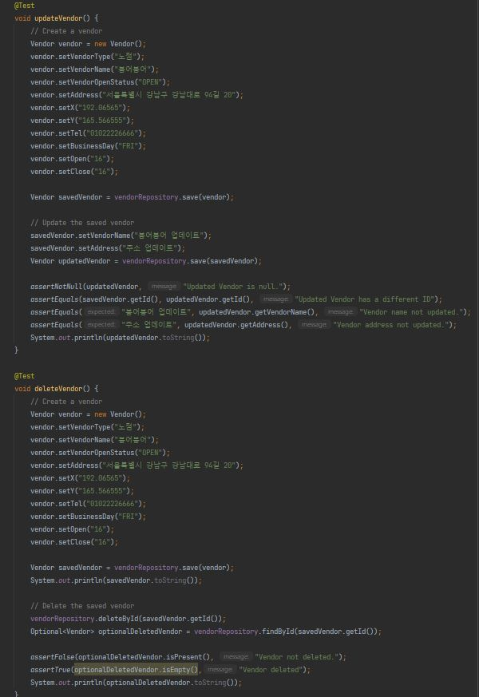
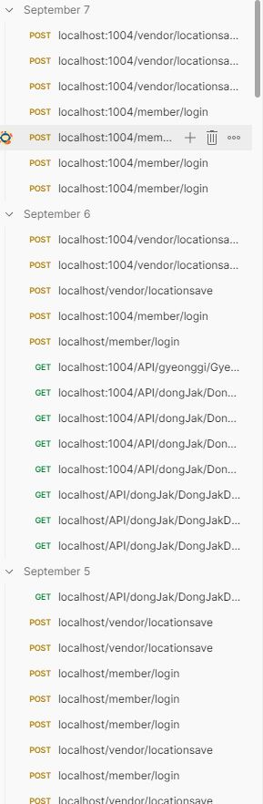

# 1. Project Structure

# 2. 개발 환경 구축

# 3. 테스트 전략
단위 테스트(Unit Test) < 통합 테스트(Integration Test) < 기능 테스트(Functional Test) 

###  1. 단위 테스트 : 단위 테스트는 Spring에 Junit을 이용하여 구현하고 실행 했습니다.
소스코드의 특정 모듈(프로그램 내 하나의 기능을 부르는 말)이 의도된 대로 정확히 작동하는지 검증하는 절차이며,

함수, 메서드, 개별 코드 같은 작은 단위에 대해 테스트 케이스(Test Case)로 분리하고 테스트 코드를 작성하여 테스트하는 것을 말한다.

외부 API와의 연동이 필수라든가 DB 데이터 접근 등 외부 리소스를 직접 사용해야 하는 테스트라면 단위 테스트가 아니다. 단위 테스트에서 외부와의 연동이 필요하다면 테스트 대역(Test Double)을 사용하면 된다.  
Given/When/Then 패턴
Given : 어떠한 데이터가 주어질 때.

When : 어떠한 기능을 실행하면.

Then : 어떠한 결과를 기대한다.

#### 의존성 주입

#### 컨트롤러 계층 단위 테스트 

#### 서비스 계층 단위 테스트

 

#### 레포지토리 계층 단위 테스트

### 2. 통합 테스트 
단위 테스트로는 RequestMapping, Data Binding, Type Conversion, Validation, 등등을 커버할 수 없습니다. 따라서 코드 커버리지를 높이기 위해서는 통합테스트를 실시해야합니다.

장점
- 모든 빈을 컨테이너에 올리고 테스트 하기 때문에 운영환경과 유사한 환경에서 테스트를 할 수 있습니다.

- 통합테스트 이름 그대로, 전체적인 테스트를 진행할 수 있어, 코드 커버리지가 높아집니다.

단점
- 모든 빈을 컨테이너에 올리고 테스트 하기 때문에 시간이 오래걸립니다.

- 전체적인 테스트를 한번에 진행하기 때문에, 특정 계층 또는 특정 빈에서 발생하는 오류의 디버깅이 어렵습니다.
### PostMan 통합 테스트 
 
# 4. 애플리케이션 배포

# 5. API 엔드 포인트 목록 및 사용법
 ### [API 명세서](https://app.swaggerhub.com/apis/BONG94688_1/mukjachiv1/v1)
# 6. 참고 자료
### [상세 정보 ](https://elastic-vanilla-3d4.notion.site/449ab326c7ac4a6d85e711f742534c7a?pvs=4)